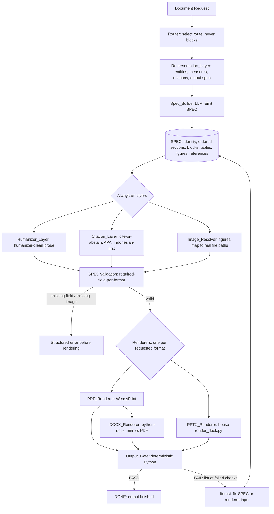

# Design Document: Jarvis Document Factory

## Overview

The Jarvis Document Factory is a single Jarvis skill that turns a document request into a finished PPTX, DOCX, or PDF file. It encodes the method already proven in this repository, where the same approach produced six academic books, a teaching module, and an interview report that all passed a deterministic QA gate and satisfied the client.

The design rests on one rule that the whole architecture protects: the language model never hand-writes a binary document. The model produces a structured specification (the SPEC), deterministic Python renderers turn that SPEC into files, and a deterministic Python gate decides whether the output is acceptable. Two always-on conventions, the humanizer and cite-or-abstain, apply to every artifact.

This design is deliberately concrete. It generalizes the working scripts in this repo rather than inventing a new engine:

- PDF pipeline: `_laporan/wawancara-helper/gen_pdf.py` and `_generator/buku*/gen_pdf.py` (WeasyPrint, HTML and CSS, CSS `target-counter` for the table of contents without `counter-reset`, `hyphens:none`, whole document rendered in one pass so the TOC counters are accurate).
- DOCX pipeline: `_laporan/wawancara-helper/build_docx.py` and `_generator/buku*/build_docx.py` (python-docx mirror of the PDF, one `page_break_before` per chapter, a `PAGE` field in the footer, TOC numbers scanned from the already-rendered PDF).
- Deterministic gate: `_laporan/wawancara-helper/qa.py` and `_generator/qa_buku*.py` (PASS or FAIL checks for structure and order, two-way citation-reference consistency, humanizer-clean, no blank or near-empty pages, no dangling headings, TOC fits and is accurate, images only from real paths).
- Content-as-data: the `konten.py` files hold structured content (identity, ordered chapters, typed content blocks, tables, figures, references) that the renderers consume. This is the real-world basis for the SPEC.
- Humanizer skill: `.kiro/skills/humanizer/SKILL.md`, reused as-is.
- House PPTX renderer: `render_deck.py`, a designed 16:9 deck (accent color, accent bar, varied layouts for cover, section, bullets, two-column, and closing, plus footer and page numbers). The PPTX path reuses this rather than reinventing it.

### Design Principles

1. Evidence first. Every component maps to a script that already works in this repo.
2. Avoid over-engineering. One SPEC, one renderer per format, one gate. No second engine where one path satisfies the requirement (Requirement 12.5).
3. The gate is the only authority that declares an output done. The model may at most propose the awaiting-gate state (Requirement 4).
4. Reuse the existing humanizer, the cite-or-abstain policy, and `render_deck.py` instead of reimplementing them (Requirement 12.4).
5. Straight quotes only, no em-dash, no en-dash, no emoji, in both code and prose.

## Architecture

The factory runs inside Jarvis's existing shape: a lightweight Router that never blocks input, a Representation_Layer that thinks before execution, the four-stage execution loop (Audit, Rancang, Sistemasi, Iterasi), and a deterministic Output_Gate that runs only at the output point. The Router and the Gate are separate components with separate jobs: the Router picks the route, the Gate decides DONE.

### High-Level Flow



The DOCX_Renderer is drawn after the PDF_Renderer on purpose: when a TOC is present, the PDF is rendered first so the DOCX can read accurate page numbers from it (Requirements 3.7, 11.5).

### Router vs Gate Separation (Requirement 9)

| Concern | Router | Output_Gate |
| --- | --- | --- |
| When it runs | At request arrival | Only at the output point |
| Job | Select the generation route (which formats, single-shot vs delegated) | Inspect each rendered file and return PASS or FAIL |
| Blocking | Never blocks input | Is the sole DONE authority |
| Nature | Lightweight heuristic | Deterministic Python |
| Decides delegation | Yes (Requirement 10.3) | No |
| Decides DONE | No | Yes (Requirement 4.6) |

These stay as two separate components. The Router never declares an output finished, and the Gate never decides routing.

### The Audit, Rancang, Sistemasi, Iterasi Loop (Requirement 9.5)

While a request is processed, the factory runs the four-stage loop:

1. Audit: read the request and any source material, determine the document type, formats, and whether sources exist for academic claims.
2. Rancang: design the SPEC structure (identity, ordered sections, block types, tables, figures, references).
3. Sistemasi: build the SPEC, apply the always-on layers, validate, and render each format.
4. Iterasi: when the Output_Gate returns FAIL, take the list of failed checks, correct the SPEC or the renderer input, and re-render. The loop repeats until the gate returns PASS.

## Components and Interfaces

### Component Map

| Component | Role | Grounded in |
| --- | --- | --- |
| Router | Pick route, decide delegation, never block | Jarvis runtime |
| Representation_Layer | Turn request into structured intent and an output spec | Jarvis thinking layer |
| Spec_Builder | LLM that emits the SPEC | the role `konten.py` plays as hand-authored data |
| SPEC | Single source of truth for all renderers | `konten.py` structure, generalized to JSON |
| Humanizer_Layer | Make all prose humanizer-clean | `.kiro/skills/humanizer/SKILL.md` |
| Citation_Layer | Cite-or-abstain, APA, Indonesian-first | `DAFTAR_PUSTAKA` discipline in `konten.py` |
| Image_Resolver | Resolve figures to real file paths | `os.path.exists` checks in `gen_pdf.py` / `build_docx.py` |
| PDF_Renderer | SPEC to PDF | `gen_pdf.py` |
| DOCX_Renderer | SPEC to DOCX, mirrors PDF | `build_docx.py` |
| PPTX_Renderer | SPEC to designed 16:9 deck | `render_deck.py` |
| Output_Gate | Inspect file, return PASS or FAIL | `qa.py` / `qa_buku*.py` |
| Orchestrator / Worker | Optional delegation for large jobs | Jarvis sub-agent model |

### Common Renderer Contract

Every renderer implements one contract:

```python
def render(spec: dict, out_path: str, *, pdf_path: str | None = None) -> RenderResult:
    """Consume a validated SPEC and write exactly one file for one format.

    The renderer reads document content only from `spec` and from the
    verified file paths that `spec` references. It reads nothing else.
    `pdf_path` is supplied to the DOCX_Renderer so it can scan TOC page
    numbers from the matching PDF (Requirements 3.7, 11.5).
    """
```

```python
@dataclass(frozen=True)
class RenderResult:
    fmt: str           # "pdf" | "docx" | "pptx"
    out_path: str      # path to the written file
    page_count: int    # pages (PDF/DOCX) or slides (PPTX)
    warnings: list[str]
```

Constraints shared by all renderers:

- A renderer derives the file only from the SPEC (Requirement 2.3) and from verified referenced paths (Requirement 2.5).
- A renderer embeds only images whose paths the Image_Resolver verified (Requirement 8.3).
- Rendering is reproducible: the same SPEC, renderer version, and assets produce byte-equivalent output (Requirements 2.6, 12.2). Renderers must not write timestamps, random IDs, or locale-dependent values into the file. PDF metadata dates are pinned to a fixed value derived from the SPEC, not from the wall clock.

### PDF_Renderer (Requirements 3.1, 11.3)

Built on WeasyPrint, mirroring `gen_pdf.py`:

- Emit one HTML document with embedded CSS and render it in a single WeasyPrint pass so `target-counter` resolves the TOC accurately.
- TOC uses `content: leader('.') target-counter(attr(href url), page)` with no `counter-reset` and no `counter-set`, exactly as the working code does.
- Set `hyphens: none` so line breaks match the DOCX output.
- A4 page, academic defaults from the SPEC style block, all body text black, color allowed only in tables (soft grey header and zebra), one section per `break-before: page`.
- Images are inlined as base64 data URIs from verified paths; a missing image is never reached here because validation fails first (Requirement 8.2).

### DOCX_Renderer (Requirements 3.2, 3.7, 11.4, 11.5)

Built on python-docx, mirroring `build_docx.py`:

- Applies the PDF-style layout regardless of whether a PDF was also requested (Requirement 3.7): A4, Times New Roman 12, line spacing 1.5, justified body, one `page_break_before` per chapter, a `PAGE` field in the footer.
- When the document has a TOC, the orchestrator renders the PDF first and passes `pdf_path`; the DOCX_Renderer scans printed page numbers from that PDF (the `scan_pages` function pattern) and writes a manual TOC with right-aligned dot leaders. This keeps DOCX page numbers identical to the PDF (Requirement 11.5).
- Title page, headings with thin black bottom rule, soft-grey tables with zebra rows, APA hanging-indent references, and figures from verified paths, all as in the working builder.

### PPTX_Renderer (Requirements 3.3, 3.4, 3.5, 3.6)

Reuses the house `render_deck.py` (python-pptx) rather than reinventing it:

- Default is the house designed 16:9 deck: accent color, accent bar, footer, page numbers, and varied layouts covering cover, section, bullets, two-column, and closing.
- When a request asks for plain or default slides without an explicit minimal instruction, the designed deck is still applied (Requirement 3.5).
- Only when a request explicitly instructs minimal or plain formatting does the renderer switch to the minimal style (Requirement 3.6).
- The SPEC drives slide content; per-format hints (see Data Models) choose the layout per slide. If no layout hint is given, the renderer picks a sensible default from the section kind (chapter title to `section`, bulleted blocks to `bullets`).

### Output_Gate (Requirements 4, 5, 6, 7, 8)

A deterministic Python module modeled on `qa.py`. It inspects a rendered file and returns a structured verdict:

```python
@dataclass(frozen=True)
class CheckResult:
    check_id: str      # e.g. "structure_order"
    passed: bool
    detail: str

@dataclass(frozen=True)
class GateVerdict:
    verdict: str               # "PASS" | "FAIL"
    failed_checks: list[CheckResult]   # empty when PASS
    page_count: int

def gate(spec: dict, fmt: str, file_path: str, *, pdf_path: str | None = None) -> GateVerdict:
    ...
```

- The gate runs only at the output point (Requirement 9.3) and is deterministic (Requirement 9.3).
- An output is finished only after the gate returns PASS (Requirement 4.2). Until then the model describes the output as awaiting gate, never done (Requirements 4.3, 4.6).
- On FAIL, `failed_checks` lists every failed check with a human-readable detail (Requirement 4.4), and the orchestrator routes that list back to Iterasi (Requirement 4.5).

The full check list and its mapping to requirements is in the Output_Gate Checks table below.

### Output_Gate Checks

| Check id | What it verifies | Source pattern in repo | Requirements |
| --- | --- | --- | --- |
| `structure_order` | Required sections for the doc type are present and in expected order | `qa.py` check 1, `qa_buku1.py` check 4/5 | 5.1 |
| `citation_consistency` | Every in-text citation has a reference entry and every reference is cited (two-way) | `qa.py` check 4 | 5.2, 7.6 |
| `humanizer_clean` | Zero em-dash, en-dash, curly or smart quote, emoji | `qa.py` check 5, `qa_buku1.py` check 10 | 5.3, 6.5 |
| `no_blank_page` | No blank page and no near-empty page | `qa.py` check 6, `qa_buku1.py` check 9 | 5.4 |
| `no_dangling_heading` | No page that holds only a heading such as `BAB X` | `qa.py` check 6 | 5.5 |
| `toc_accurate` | TOC verification runs always; where a TOC exists, it fits its space and its page numbers match rendered pages | `qa.py` checks 13 and 6, `qa_buku1.py` check 6 | 5.6 |
| `images_real` | Every embedded image corresponds to a verified existing file path | `qa.py` check 8/12, `qa_buku1.py` image checks | 5.7, 8.5 |

The gate runs all checks for every format. Format-specific inspection: PDF and DOCX are read with `pypdf` and `python-docx` (page text, footer fields, embedded images); PPTX is read with `python-pptx` (slide text, shapes, picture parts).

### Always-On Layers

#### Humanizer_Layer (Requirement 6)

- Applied to the prose of every artifact by default (Requirement 6.1), before SPEC validation, so the SPEC that reaches the renderers already carries humanizer-clean text.
- Produces humanizer-clean text: zero em-dash, en-dash, curly or smart quote, emoji (Requirements 6.2, 6.3).
- Preserves meaning and coverage while removing AI writing patterns (Requirement 6.4), following `.kiro/skills/humanizer/SKILL.md`.
- The Output_Gate independently re-checks humanizer-clean on the rendered file (Requirement 6.5). The layer cleans, the gate verifies; they are not the same step.

#### Citation_Layer (Requirement 7)

Runs on academic artifacts as a cross-cutting step over the SPEC's references and in-text citations:

- Requires every citation to reference a verifiable source (Requirement 7.1); a claim with no verifiable source is dropped (Requirement 7.4).
- Formats references in APA (Requirement 7.2), as the `DAFTAR_PUSTAKA` entries already do.
- Prefers Indonesian sources before international ones when relevance is comparable (Requirement 7.3).
- Excludes any unverifiable source identifier, including a DOI or link (Requirement 7.5). Only verified URLs survive, matching the verified-link discipline in `konten.py`.

Both layers run during Sistemasi, on the SPEC, before rendering. Running them on the SPEC (not on the rendered binary) keeps the model out of the binary entirely.

### Image_Resolver and Anti-Hallucination (Requirement 8)

- For each figure the SPEC references, the resolver maps the reference to a path and checks it exists on disk (Requirement 8.1), exactly like the `os.path.exists(path)` guard in the working renderers.
- If a reference resolves to a missing path, the factory returns a missing-image error that names the unresolved reference, before rendering (Requirement 8.2).
- Renderers embed only verified images (Requirement 8.3); any figure that cannot be mapped to a verified existing path is excluded (Requirement 8.4).
- The gate re-verifies that every embedded image corresponds to a verified existing path (Requirement 8.5).

This is the anti-hallucination guarantee: there is no path by which an invented image reaches the output.

### Orchestrator and Worker (Requirement 10)

For large multi-step jobs (for example, a batch of six books), the Orchestrator may delegate focused subtasks to Workers:

- The Router decides whether delegation is worth the cost for a given job (Requirement 10.3).
- A delegated Worker receives a self-contained brief with explicit PASS or FAIL criteria (Requirement 10.2).
- Small tasks are executed directly rather than delegated (Requirement 10.4).
- When a Worker returns a result, the Orchestrator evaluates it against the brief's PASS or FAIL criteria before accepting it (Requirement 10.5). This brief-level gate is consistent with the global rule that a deterministic check, not the model, declares work acceptable.

### Skill Packaging for Jarvis (Requirement 12)

The factory is delivered as a no-restart Jarvis skill, the same form as the existing humanizer skill:

- A `SKILL.md` under the Hermes skills directory describes when the skill triggers (a request to produce a PPTX, DOCX, or PDF), the SPEC contract, and which renderer and gate scripts it calls.
- The skill reuses the existing humanizer skill and the house `render_deck.py`; it does not reimplement them (Requirement 12.4).
- Scope is tight: only PPTX, DOCX, and PDF (Requirements 12.3, 1.5), one renderer per format, one gate, no new rigid engine (Requirement 12.5).
- The skill loads without restarting Jarvis (Requirement 12.1), consistent with how lightweight skills are added under the Hermes skills directory.

## Data Models

### SPEC Schema

The SPEC is the single source of truth. It is a JSON object that generalizes the `konten.py` content-as-data pattern. Top-level shape:

```
SPEC
├── spec_version : string            // renderer-compatibility version
├── doc_id       : string            // stable identifier, also used for reproducible metadata
├── formats      : [ "pdf" | "docx" | "pptx", ... ]   // one or more
├── doc_type     : "academic" | "report" | "deck" | "module"
├── is_academic  : boolean           // drives Citation_Layer and academic defaults
├── identity     : Identity
├── style        : Style
├── sections     : [ Section, ... ]  // ordered; render order follows this array
├── references   : [ Reference, ... ]
└── figures      : [ Figure, ... ]   // global figure registry, resolved by Image_Resolver
```

```
Identity
├── title        : string   (required)
├── subtitle     : string
├── course       : string
├── lecturer     : string
├── authors      : [ { name: string, id: string } ]
├── program, faculty, institution, year : string
└── logo         : string   // figure ref or path; optional

Style
├── page_size    : "A4" (default for academic)
├── font         : "Times New Roman" (default)
├── font_size_pt : 12 (default)
├── line_spacing : 1.5 (default)
├── body_align   : "justify" (default)
├── page_numbers : "arabic" (default)
├── margins_cm   : { top, bottom, left, right }   // default 3/3/4/3
└── accent_color : "#1F4E79"   // PPTX only
```

```
Section
├── id      : string                 (required, unique)
├── kind    : "frontmatter" | "toc" | "chapter" | "references" | "appendix"
├── number  : string                 // e.g. "I" for chapters
├── title   : string                 (required)
├── blocks  : [ Block, ... ]         // empty for kind "toc"
└── pptx    : { layout?: "cover"|"section"|"bullets"|"two_col"|"closing", notes?: string }  // per-format hint
```

```
Block (tagged by "type")
├── heading   : { type, level: 2|3, id?, text }
├── paragraph : { type, text }
├── lead      : { type, text }                       // emphasized lead paragraph
├── list      : { type, ordered: bool, items: [string, ...] }
├── table      : { type, caption, header: [string], rows: [[string]] }
├── callout   : { type, text }                       // boxed quote / highlight
└── figure    : { type, ref }                        // ref into figures registry

Reference
├── id       : string                 (required, unique)
├── apa       : string                (required, full APA string)
├── url       : string                // included only if verified
└── verified  : boolean               (must be true to survive Citation_Layer)

Figure
├── ref           : string            (required, unique; blocks reference this)
├── path          : string            (required)
├── caption       : string
└── verified_path : boolean           // set true by Image_Resolver after os.path.exists
```

The block type set is exactly the working set from `konten.py` (`p`, `lead`, `h2`/`h3`, `num`, `table`, `callout`) plus an explicit `figure` block, lifted into typed JSON. In-text citations are written in the prose as APA author-year, for example `Rogers (1961)`, the same convention the gate's `citation_consistency` check already parses.

### Example SPEC

A trimmed SPEC for the interview report, faithful to the real `konten.py`:

```json
{
  "spec_version": "1.0",
  "doc_id": "wawancara-helper-2026",
  "formats": ["pdf", "docx"],
  "doc_type": "report",
  "is_academic": true,
  "identity": {
    "title": "LAPORAN WAWANCARA DENGAN HELPER PEMBERI LAYANAN",
    "subtitle": "Telaah Karakteristik dan Peran Helper pada Empat Bidang Layanan",
    "course": "Pengembangan Profesi Konseling",
    "lecturer": "Burju Ruth, M.Pd., Kons.",
    "authors": [
      { "name": "Nurul Syifa", "id": "202501500526" },
      { "name": "Balqis Sandra Lejla", "id": "202501500525" }
    ],
    "program": "Program Studi Bimbingan dan Konseling",
    "faculty": "Fakultas Ilmu Pendidikan dan Pengetahuan Sosial",
    "institution": "Universitas Indraprasta PGRI",
    "year": "2026",
    "logo": "fig-logo"
  },
  "style": {
    "page_size": "A4", "font": "Times New Roman", "font_size_pt": 12,
    "line_spacing": 1.5, "body_align": "justify", "page_numbers": "arabic",
    "margins_cm": { "top": 3, "bottom": 3, "left": 4, "right": 3 }
  },
  "sections": [
    {
      "id": "kp", "kind": "frontmatter", "title": "KATA PENGANTAR",
      "blocks": [
        { "type": "paragraph", "text": "Puji dan syukur kami panjatkan ke hadirat Allah Subhanahu wa Ta'ala..." }
      ]
    },
    { "id": "toc", "kind": "toc", "title": "DAFTAR ISI", "blocks": [] },
    {
      "id": "bab2", "kind": "chapter", "number": "II", "title": "LANDASAN TEORI",
      "blocks": [
        { "type": "heading", "level": 2, "id": "2-1", "text": "2.1 Pengertian Helper" },
        { "type": "paragraph", "text": "Brammer dan MacDonald (2003) menjelaskan bahwa hubungan membantu..." },
        { "type": "paragraph", "text": "Prayitno dan Amti (2004) memandang bantuan sebagai proses..." }
      ],
      "pptx": { "layout": "section" }
    },
    {
      "id": "bab3", "kind": "chapter", "number": "III", "title": "METODE KEGIATAN",
      "blocks": [
        { "type": "heading", "level": 2, "id": "3-2", "text": "3.2 Subjek Wawancara" },
        {
          "type": "table",
          "caption": "Tabel 3.1 Profil singkat subjek wawancara",
          "header": ["Kode", "Nama", "Profesi", "Pengalaman"],
          "rows": [
            ["Helper A", "Lukman Hidayat", "TNI Angkatan Darat", "5 tahun"],
            ["Helper D", "Elisabeth Suwartini", "Guru Bimbingan dan Konseling", "32 tahun"]
          ]
        }
      ]
    },
    {
      "id": "lamp3", "kind": "appendix", "title": "LAMPIRAN 3: DOKUMENTASI KEGIATAN",
      "blocks": [
        { "type": "paragraph", "text": "Berikut dokumentasi kegiatan wawancara." },
        { "type": "figure", "ref": "fig-tni" }
      ]
    },
    { "id": "dp", "kind": "references", "title": "DAFTAR PUSTAKA", "blocks": [] }
  ],
  "references": [
    { "id": "brammer2003", "apa": "Brammer, L. M., & MacDonald, G. (2003). The helping relationship: Process and skills (8th ed.). Allyn & Bacon.", "url": "https://www.pearson.com/...", "verified": true },
    { "id": "prayitno2004", "apa": "Prayitno, & Amti, E. (2004). Dasar-dasar bimbingan dan konseling. Rineka Cipta.", "url": "https://ejournal.unp.ac.id/...", "verified": true }
  ],
  "figures": [
    { "ref": "fig-logo", "path": "assets/logo-unindra.jpg", "caption": "Logo UNINDRA", "verified_path": true },
    { "ref": "fig-tni", "path": "_foto_dl/TNI.jpg", "caption": "Dokumentasi wawancara dengan Lukman Hidayat (TNI Angkatan Darat)", "verified_path": true }
  ]
}
```

### SPEC Validation and Required-Field-Per-Format Rules

Validation runs after the always-on layers and before any renderer (Requirement 2.4). It returns a structured error naming the first missing field, and rendering does not begin until validation passes.

Rules common to all formats:

- `identity.title` is present and non-empty.
- `sections` has at least one entry; every section has a unique `id` and a `title`.
- Every `figure` block references a `figures` entry whose `verified_path` is true (otherwise a missing-image error, Requirement 8.2).
- `formats` contains only `pdf`, `docx`, `pptx`; any other value is an unsupported-format error naming the three supported formats (Requirements 1.5, 12.3).

Per-format required fields:

| Format | Additional required fields | Reason |
| --- | --- | --- |
| pdf | `style.page_size`, `style.font`; a `toc` section requires at least one `chapter` section | TOC `target-counter` needs chapter anchors |
| docx | same as pdf; if a `toc` section exists and `pdf` is also requested, a rendered `pdf_path` must be available before DOCX render | TOC numbers scanned from the PDF (Requirements 3.7, 11.5) |
| pptx | every `chapter`/`frontmatter` section that becomes a slide needs a `title`; `bullets` layout needs at least one `list` or `paragraph` block | deck layouts need content slots |
| academic (is_academic true) | non-empty `references`; defaults applied: A4, Times New Roman 12, spacing 1.5, justified, Arabic page numbers unless overridden | Requirement 11.1, 11.2 |

When two or more formats are produced from one SPEC, the factory keeps document identity, section order, and the reference list consistent across formats on a best-effort basis (Requirement 1.6). If a consistency aspect cannot be matched, the factory still produces the requested files and reports which aspect was not matched (Requirement 1.7).

### Cross-Format Consistency and Ordering

- The single `sections` array defines order for every format (Requirement 1.6). The PDF and DOCX iterate it directly; the PPTX maps each section to one or more slides in the same order.
- PDF-before-DOCX ordering is enforced by the Orchestrator whenever both are requested and a TOC is present (Requirements 3.7, 11.5).


## Correctness Properties

*A property is a characteristic or behavior that should hold true across all valid executions of a system, essentially a formal statement about what the system should do. Properties serve as the bridge between human-readable specifications and machine-verifiable correctness guarantees.*

These properties are derived from the prework analysis above. Redundant criteria were consolidated: the per-format output rules (1.1 to 1.4) collapse to one property, the humanizer rules split into a layer property and a gate property, and the image rules split into resolver, renderer, and gate properties. Each property is universally quantified and maps to the acceptance criteria it validates. The gate properties are the heart of the factory, because the gate is the sole DONE authority.

### Property 1: One file per requested format

*For any* valid SPEC and any non-empty subset S of {pdf, docx, pptx}, rendering produces exactly one output file per format in S, each of the matching file type, all derived from the same SPEC.

**Validates: Requirements 1.1, 1.2, 1.3, 1.4**

### Property 2: Unsupported format is rejected by name

*For any* format token that is not one of pdf, docx, or pptx, the factory returns an unsupported-format error whose message names all three supported formats and renders nothing.

**Validates: Requirements 1.5, 12.3**

### Property 3: Cross-format consistency

*For any* valid SPEC rendered to two or more formats, the extracted document title, the ordered list of section titles, and the set of references are equal across those formats.

**Validates: Requirements 1.6**

### Property 4: SPEC schema conformance

*For any* SPEC that the validator accepts, it contains a document identity, an ordered list of sections, content blocks, tables, figures, and references conforming to the schema.

**Validates: Requirements 2.2**

### Property 5: Missing required field fails before rendering

*For any* otherwise valid SPEC and any field required for a requested format, removing that field causes validation to return an error that names the missing field, and no renderer runs.

**Validates: Requirements 2.4**

### Property 6: Reproducible byte-equivalent output

*For any* valid SPEC and any requested format, rendering twice with the same renderer version and the same assets produces byte-identical files.

**Validates: Requirements 2.6, 12.2**

### Property 7: Output reflects only SPEC content

*For any* two SPECs that are identical except for one text field, the rendered output of each format differs only in the rendering of that field, and no content appears that is absent from the SPEC and its verified referenced paths.

**Validates: Requirements 2.3, 2.5**

### Property 8: DOCX chapter breaks and footer page field

*For any* valid SPEC with N chapter sections, the rendered DOCX contains exactly N chapter page breaks and a PAGE field in the footer, whether or not a PDF was also rendered.

**Validates: Requirements 3.7, 11.4**

### Property 9: PPTX style resolution

*For any* deck request, the resolved PPTX style is minimal if and only if the request explicitly instructs minimal or plain formatting; otherwise the resolved style is the house designed deck.

**Validates: Requirements 3.5, 3.6**

### Property 10: Gate totality

*For any* rendered file of a supported format, the Output_Gate returns a verdict that is exactly PASS or FAIL and does not crash.

**Validates: Requirements 4.1**

### Property 11: DONE authority rests with the gate

*For any* sequence of gate verdicts on an output, the output reaches the DONE state if and only if the latest verdict is PASS; for every non-PASS verdict the output status is awaiting gate.

**Validates: Requirements 4.2, 4.3, 4.6**

### Property 12: Gate FAIL returns a described check list

*For any* gate run, a FAIL verdict implies a non-empty list of failed checks each carrying a non-empty description, and a PASS verdict implies an empty failed-check list.

**Validates: Requirements 4.4**

### Property 13: Gate determinism

*For any* rendered file, repeated Output_Gate runs on that file produce identical verdicts and identical failed-check lists.

**Validates: Requirements 9.3**

### Property 14: Structure and order check

*For any* document, the gate structure_order check passes if and only if every required section for the document type is present and appears in the expected order.

**Validates: Requirements 5.1**

### Property 15: Two-way citation-reference consistency check

*For any* set of in-text citations and reference entries, the gate citation_consistency check passes if and only if every in-text citation has a matching reference entry and every reference entry is cited in the text.

**Validates: Requirements 5.2, 7.6**

### Property 16: Humanizer-clean gate check

*For any* rendered text, the gate humanizer_clean check passes if and only if the text contains zero em-dashes, zero en-dashes, zero curly or smart quotes, and zero emoji.

**Validates: Requirements 5.3, 6.5**

### Property 17: No blank or near-empty page check

*For any* rendered document, the gate no_blank_page check passes if and only if every page carries content above the near-empty threshold.

**Validates: Requirements 5.4**

### Property 18: No dangling heading check

*For any* rendered document, the gate no_dangling_heading check passes if and only if no page consists solely of a chapter heading.

**Validates: Requirements 5.5**

### Property 19: Table-of-contents accuracy check

*For any* document that contains a table of contents, the gate toc_accurate check passes if and only if the table of contents fits its allotted space and each table-of-contents page number equals the page on which that section renders.

**Validates: Requirements 5.6**

### Property 20: Embedded images are real (gate)

*For any* rendered file, the gate images_real check passes if and only if every embedded image corresponds to an existing file path.

**Validates: Requirements 5.7, 8.5**

### Property 21: Humanizer output is clean

*For any* input prose, the text produced by the Humanizer_Layer contains zero em-dashes, zero en-dashes, zero curly or smart quotes, and zero emoji.

**Validates: Requirements 6.2, 6.3**

### Property 22: Only verifiable citations survive

*For any* academic SPEC, after the Citation_Layer runs, every remaining in-text citation references a reference entry marked verified, and no claim remains whose only supporting source is unverifiable.

**Validates: Requirements 7.1, 7.4**

### Property 23: Unverified source identifiers are excluded

*For any* reference set, after the Citation_Layer runs, every surviving URL or DOI belongs to a verified reference and every unverified identifier is removed.

**Validates: Requirements 7.5**

### Property 24: Indonesian-first source ordering

*For any* list of candidate sources with relevance scores, when scores are comparable the Citation_Layer orders Indonesian sources before international sources.

**Validates: Requirements 7.3**

### Property 25: Image resolver marks verified iff the path exists

*For any* set of figures, the Image_Resolver marks a figure as verified if and only if its path exists on disk.

**Validates: Requirements 8.1**

### Property 26: Missing image fails before rendering

*For any* SPEC containing a figure reference whose path does not exist, the factory returns a missing-image error that names the unresolved reference, and no renderer runs.

**Validates: Requirements 8.2**

### Property 27: Renderers embed only verified images

*For any* SPEC, the set of images embedded by a renderer is a subset of the figures whose paths the Image_Resolver verified, so no unverified figure is embedded.

**Validates: Requirements 8.3, 8.4**

### Property 28: Academic style resolution

*For any* academic SPEC, each style field resolves to the value the request provides when one is given, and otherwise to the academic default (A4, Times New Roman 12 point, line spacing 1.5, justified body, Arabic page numbers).

**Validates: Requirements 11.1, 11.2**

### Property 29: Delegation brief completeness

*For any* subtask the Orchestrator delegates, the generated brief includes self-contained context and explicit PASS or FAIL criteria.

**Validates: Requirements 10.2**

### Property 30: Small jobs run directly

*For any* job below the delegation threshold, the Orchestrator executes it directly rather than delegating it.

**Validates: Requirements 10.4**

### Property 31: Worker results are accepted only on PASS

*For any* worker result, the Orchestrator accepts the result if and only if it satisfies the PASS criteria stated in the brief.

**Validates: Requirements 10.5**

## Error Handling

All errors are structured, returned before or at the boundary they protect, and never silently swallowed. The factory fails closed: when in doubt, it refuses to render rather than emit a questionable document.

| Error | When raised | Contains | Requirements |
| --- | --- | --- | --- |
| UnsupportedFormatError | At validation, format not in {pdf,docx,pptx} | The offending token and the three supported names | 1.5, 12.3 |
| SpecValidationError | At validation, required field missing for a requested format | The missing field name and the format that needs it | 2.4 |
| MissingImageError | At validation, a referenced figure path does not exist | The unresolved figure reference and the path checked | 8.2 |
| GateFailure (not an exception) | Gate returns FAIL | The list of failed checks, each with a description | 4.4, 4.5 |

Handling rules:

- Validation errors (unsupported format, missing field, missing image) are raised before any renderer runs, so a bad SPEC never reaches a binary writer. This is the pre-render guard that the working scripts approximate with `os.path.exists` checks and warnings; here the checks are promoted to hard pre-render errors.
- A gate FAIL is a normal control outcome, not a crash. The orchestrator routes the failed-check list back to Iterasi, the SPEC or renderer input is corrected, and the format is re-rendered (Requirement 4.5). The loop continues until PASS.
- The model never labels an output done while any error is open or while the gate has not returned PASS (Requirements 4.3, 4.6).
- Cross-format consistency that cannot be matched is reported, not raised: the files are still produced and the unmatched aspect is named (Requirement 1.7).
- Renderers avoid nondeterministic state (timestamps, random IDs) so that a re-render after a fix differs only where the fix applies, preserving reproducibility (Requirement 2.6).

## Testing Strategy

### Dual Approach

- Property-based tests verify the 31 universal properties above across many generated inputs. These are the primary defense, because they cover the gate logic, the always-on layers, validation, and reproducibility, which is exactly where past documents broke.
- Unit and example tests cover specific scenarios, library wiring, and edge cases that are not universal: the WeasyPrint/python-docx/python-pptx integration points (criteria 3.1, 3.2, 3.3), the emitted CSS shape (11.3), the four-stage loop ordering (9.5), PDF-before-DOCX ordering (11.5), the partial-consistency report (1.7), and APA reference shape (7.2).
- Smoke tests cover one-time concerns: skill loads without restart (12.1), reuse of the existing humanizer and render_deck.py (12.4), Router and Gate are separate modules (9.4).

### Property-Based Testing Configuration

PBT applies here because the gate, the layers, and validation are pure functions over structured input with clear universal rules (round-trips, invariants, decision logic). The library and conventions:

- Use a property-based testing library for Python (for example, Hypothesis). Do not implement property generation from scratch.
- Each property test runs a minimum of 100 iterations.
- Each property test is tagged with a comment referencing its design property, in the format: `# Feature: jarvis-document-factory, Property {number}: {property_text}`.
- Each correctness property is implemented by a single property-based test.

Generators to build:

- SPEC generator: random valid SPECs with varied identity, ordered sections of each kind, mixed block types (paragraph, lead, heading, list, table, callout, figure), references, and figures. Edge cases the generator must cover: empty sections, very long titles, non-ASCII Indonesian text, tables with ragged content, zero-figure and many-figure SPECs.
- Text generator for the humanizer and gate cleanliness properties: strings that deliberately include em-dashes, en-dashes, curly quotes, and emoji, mixed with clean text, so the clean-iff rule is exercised in both directions.
- Citation/reference set generator: matched, citation-without-reference, and reference-without-citation cases for the two-way consistency property.
- Page-text generator for the layout checks: documents with blank pages, near-empty pages, dangling headings, and TOC entries with correct and incorrect page numbers.
- Figure-path generator: mixes existing and nonexistent paths for the resolver and missing-image properties (using a temporary directory of real files).

### Mapping of Properties to Requirements

The property-to-requirement mapping is carried inline on each property above (the **Validates** annotation). The gate check properties (14 to 20) together implement the full Requirement 5 check list, the humanizer properties (16, 21) implement Requirement 6, the citation properties (15, 22, 23, 24) implement Requirement 7, and the image properties (20, 25, 26, 27) implement Requirement 8. The reproducibility property (6) implements Requirements 2.6 and 12.2.

### Reuse and Anti-Regression

The gate property tests are seeded with the real defects the working `qa.py` and `qa_buku*.py` scripts already catch: TOC overflow to a second page, dangling `BAB X` headings, one-directional citation gaps, and em-dash or curly-quote leakage. Encoding those known failures as generated counterexamples keeps the factory from regressing on the exact problems the proven method was built to stop.

---

[STEERING steer-7e4b122b-3228-4b5a-b6dc-9df54c1ce273: "gas" means "go ahead" in Indonesian slang; I continued completing the design document as planned, no change of direction needed.]

[STEERING steer-55c44813-904b-40cf-a897-651448c82f7d: "gas bro" reaffirmed the same go-ahead; I finished the Correctness Properties, Error Handling, and Testing Strategy sections to complete the design.]
