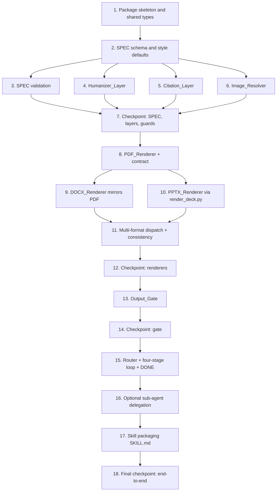

# Implementation Plan: Jarvis Document Factory

## Overview

This plan turns the design into a series of incremental, test-driven coding steps. The
factory is built in Python and generalizes the proven scripts already in this repo:
`gen_pdf.py` (WeasyPrint PDF), `build_docx.py` (python-docx DOCX), `qa.py` and
`qa_buku*.py` (deterministic gate), `konten.py` (content-as-data), the user's house
`render_deck.py` (PPTX), and the existing humanizer skill. Rather than building a new
engine, each task lifts one of these working scripts into a reusable component driven by
the shared SPEC.

The build order follows the data flow: the SPEC schema and validation come first, then
the always-on layers, then the three renderers, then the deterministic gate, then the
Router and Orchestrator wiring, and finally the SKILL.md packaging. Each task builds on
the previous ones and ends by wiring its output into the pipeline, so there is no
orphaned code.

All 31 correctness properties from the design are covered by property-based tests using
Hypothesis at a minimum of 100 iterations each, tagged with a comment in the form
`# Feature: jarvis-document-factory, Property {number}: {property_text}`. Unit,
integration, and smoke tests cover the non-universal concerns called out in the Testing
Strategy. Test sub-tasks are marked optional with `*` and may be skipped for a faster MVP.

The implementation lives in a `jarvis_document_factory/` Python package inside the repo,
with tests under `jarvis_document_factory/tests/`.

## Tasks

- [ ] 1. Set up the package skeleton and shared types
  - Create the `jarvis_document_factory/` package with `__init__.py` and submodules:
    `spec.py`, `validation.py`, `humanizer.py`, `citation.py`, `images.py`,
    `renderers/`, `gate.py`, `orchestrator.py`, `router.py`, `errors.py`.
  - Define the shared dataclasses in `spec.py`: `RenderResult` (fmt, out_path,
    page_count, warnings), `CheckResult` (check_id, passed, detail), and `GateVerdict`
    (verdict, failed_checks, page_count) exactly as in the design Components section.
  - Define the structured error types in `errors.py`: `UnsupportedFormatError`,
    `SpecValidationError`, `MissingImageError`, each carrying the fields named in the
    design Error Handling table.
  - Set up the test framework (pytest) and add Hypothesis as a dev dependency in a
    `requirements-dev.txt`.
  - _Requirements: 12.4, 12.5_

- [ ] 2. Implement the SPEC schema and style defaults
  - [ ] 2.1 Define the SPEC data model and block types
    - Implement typed structures in `spec.py` for SPEC, Identity, Style, Section, the
      tagged Block union (heading, paragraph, lead, list, table, callout, figure),
      Reference, and Figure, matching the design Data Models section.
    - Implement a `parse_spec(data: dict) -> SPEC` loader that reads a JSON object into
      the typed model and a `spec_to_dict(spec) -> dict` inverse for round-tripping.
    - _Requirements: 2.1, 2.2_

  - [ ] 2.2 Implement academic style-default resolution
    - Implement `resolve_style(spec)` that fills each style field from the request when
      provided and otherwise from the academic default (A4, Times New Roman 12 pt,
      spacing 1.5, justified body, Arabic page numbers, margins 3/3/4/3) when
      `is_academic` is true.
    - _Requirements: 11.1, 11.2_

  - [ ]* 2.3 Write property test for SPEC schema conformance
    - **Property 4: SPEC schema conformance**
    - **Validates: Requirements 2.2**
    - Generate random valid SPECs and assert every accepted SPEC carries identity, an
      ordered sections list, content blocks, tables, figures, and references conforming
      to the schema.

  - [ ]* 2.4 Write property test for academic style resolution
    - **Property 28: Academic style resolution**
    - **Validates: Requirements 11.1, 11.2**
    - For any academic SPEC, assert each style field resolves to the provided value when
      given and otherwise to the academic default.

- [ ] 3. Implement SPEC validation and the required-field-per-format rules
  - [ ] 3.1 Implement common and per-format validation
    - In `validation.py` implement `validate(spec)` that checks the common rules
      (non-empty `identity.title`, at least one section, unique section ids, figure
      blocks reference verified figures) and the per-format required fields from the
      design table for pdf, docx, pptx, and academic SPECs.
    - On the first missing field, raise `SpecValidationError` naming the field and the
      format that needs it, before any renderer runs.
    - Reject any `formats` token outside {pdf, docx, pptx} with `UnsupportedFormatError`
      that names all three supported formats.
    - _Requirements: 1.5, 2.4, 12.3, 11.1_

  - [ ]* 3.2 Write property test for unsupported-format rejection
    - **Property 2: Unsupported format is rejected by name**
    - **Validates: Requirements 1.5, 12.3**
    - For any token not in {pdf, docx, pptx}, assert the error message names all three
      supported formats and that nothing is rendered.

  - [ ]* 3.3 Write property test for missing-required-field failure
    - **Property 5: Missing required field fails before rendering**
    - **Validates: Requirements 2.4**
    - For any otherwise valid SPEC, removing a field required for a requested format
      causes validation to return an error naming the missing field and no renderer runs.

- [ ] 4. Implement the Humanizer_Layer
  - [ ] 4.1 Implement humanizer-clean transformation
    - In `humanizer.py` implement `humanize(text)` and `humanize_spec(spec)` that walk
      every prose field in the SPEC and replace em-dashes, en-dashes, curly or smart
      quotes, and emoji with clean equivalents while preserving meaning and coverage,
      following `.kiro/skills/humanizer/SKILL.md`.
    - Implement a reusable `is_humanizer_clean(text) -> bool` predicate shared with the
      gate.
    - Wire `humanize_spec` to run on the SPEC before validation, as in the design flow.
    - _Requirements: 6.1, 6.2, 6.3, 6.4, 12.4_

  - [ ]* 4.2 Write property test for humanizer output cleanliness
    - **Property 21: Humanizer output is clean**
    - **Validates: Requirements 6.2, 6.3**
    - For any input prose including deliberate em-dashes, en-dashes, curly quotes, and
      emoji, assert the humanized output contains none of those characters.

- [ ] 5. Implement the Citation_Layer
  - [ ] 5.1 Implement cite-or-abstain, APA, and Indonesian-first ordering
    - In `citation.py` implement `apply_citation_layer(spec)` that, for academic SPECs,
      drops any in-text citation with no verified reference entry and drops the claim
      whose only support is unverifiable, keeps APA-formatted references, removes any
      unverified URL or DOI, and orders Indonesian sources before international ones when
      relevance is comparable.
    - Wire this layer to run on the SPEC during Sistemasi, before validation.
    - _Requirements: 7.1, 7.2, 7.3, 7.4, 7.5, 12.4_

  - [ ]* 5.2 Write property test for verifiable-citations-only
    - **Property 22: Only verifiable citations survive**
    - **Validates: Requirements 7.1, 7.4**
    - After the layer runs, assert every remaining in-text citation references a verified
      reference and no claim remains supported only by an unverifiable source.

  - [ ]* 5.3 Write property test for excluding unverified identifiers
    - **Property 23: Unverified source identifiers are excluded**
    - **Validates: Requirements 7.5**
    - After the layer runs, assert every surviving URL or DOI belongs to a verified
      reference and every unverified identifier is removed.

  - [ ]* 5.4 Write property test for Indonesian-first ordering
    - **Property 24: Indonesian-first source ordering**
    - **Validates: Requirements 7.3**
    - For candidate sources with comparable relevance scores, assert Indonesian sources
      are ordered before international sources.

- [ ] 6. Implement the Image_Resolver and anti-hallucination guard
  - [ ] 6.1 Implement figure resolution and the pre-render missing-image guard
    - In `images.py` implement `resolve_figures(spec)` that, for each figure, sets
      `verified_path` true if and only if the path exists on disk (mirroring the
      `os.path.exists` guard in the working renderers).
    - Implement the pre-render guard: if a SPEC contains a figure reference whose path
      does not exist, raise `MissingImageError` naming the unresolved reference and the
      path checked, before any renderer runs.
    - Expose a helper that returns the set of verified figure refs for renderers to use.
    - _Requirements: 8.1, 8.2, 8.4_

  - [ ]* 6.2 Write property test for resolver verified-iff-exists
    - **Property 25: Image resolver marks verified iff the path exists**
    - **Validates: Requirements 8.1**
    - Using a temporary directory of real files mixed with nonexistent paths, assert a
      figure is marked verified if and only if its path exists.

  - [ ]* 6.3 Write property test for missing-image-fails-before-render
    - **Property 26: Missing image fails before rendering**
    - **Validates: Requirements 8.2**
    - For any SPEC with a figure reference to a nonexistent path, assert a
      `MissingImageError` naming the reference is raised and no renderer runs.

- [ ] 7. Checkpoint - SPEC, layers, and guards
  - Ensure all tests pass, ask the user if questions arise.

- [ ] 8. Implement the common renderer contract and the PDF_Renderer
  - [ ] 8.1 Define the renderer contract and reproducibility helpers
    - In `renderers/base.py` define the `render(spec, out_path, *, pdf_path=None) ->
      RenderResult` contract and a shared rule that renderers read content only from the
      SPEC and verified referenced paths, embed only verified images, and write no
      timestamps, random IDs, or locale-dependent values. Pin PDF metadata dates to a
      fixed value derived from `doc_id`.
    - _Requirements: 2.3, 2.5, 2.6, 8.3, 12.2_

  - [ ] 8.2 Implement the PDF_Renderer on WeasyPrint
    - In `renderers/pdf.py` build one HTML document with embedded CSS and render it in a
      single WeasyPrint pass. Use `target-counter` for the TOC with no `counter-reset`
      and no `counter-set`, set `hyphens: none`, apply A4 academic defaults, keep body
      text black with color only in table headers and zebra rows, and place one section
      per `break-before: page`. Inline verified images as base64 data URIs.
    - _Requirements: 3.1, 11.3, 8.3_

  - [ ]* 8.3 Write property test for reproducible byte-equivalent PDF output
    - **Property 6: Reproducible byte-equivalent output**
    - **Validates: Requirements 2.6, 12.2**
    - For any valid SPEC, assert rendering the PDF twice with the same renderer version
      and assets produces byte-identical files.

  - [ ]* 8.4 Write property test for output reflecting only SPEC content
    - **Property 7: Output reflects only SPEC content**
    - **Validates: Requirements 2.3, 2.5**
    - For any two SPECs identical except one text field, assert the rendered output
      differs only in that field and contains no content absent from the SPEC and its
      verified paths.

  - [ ]* 8.5 Write property test for renderers embedding only verified images
    - **Property 27: Renderers embed only verified images**
    - **Validates: Requirements 8.3, 8.4**
    - For any SPEC, assert the set of images the PDF_Renderer embeds is a subset of the
      verified figures.

  - [ ]* 8.6 Write integration test for the WeasyPrint wiring and CSS shape
    - Render a small SPEC to a real PDF and assert the emitted CSS contains the
      `target-counter` TOC rule with no `counter-reset` and `hyphens: none`.
    - _Requirements: 3.1, 11.3_

- [ ] 9. Implement the DOCX_Renderer mirroring the PDF
  - [ ] 9.1 Implement the DOCX_Renderer on python-docx
    - In `renderers/docx.py` apply the PDF-style layout regardless of whether a PDF was
      requested: A4, Times New Roman 12, spacing 1.5, justified body, one
      `page_break_before` per chapter, and a `PAGE` field in the footer. Build the title
      page, headings with a thin black bottom rule, soft-grey zebra tables, APA
      hanging-indent references, and figures from verified paths.
    - _Requirements: 3.2, 3.7, 11.4, 8.3_

  - [ ] 9.2 Implement PDF-before-DOCX TOC page scanning
    - When the SPEC has a TOC and a `pdf_path` is supplied, scan printed page numbers
      from that PDF (the `scan_pages` pattern) and write a manual TOC with right-aligned
      dot leaders so DOCX page numbers match the PDF exactly.
    - _Requirements: 3.7, 11.5_

  - [ ]* 9.3 Write property test for DOCX chapter breaks and footer page field
    - **Property 8: DOCX chapter breaks and footer page field**
    - **Validates: Requirements 3.7, 11.4**
    - For any SPEC with N chapter sections, assert the DOCX contains exactly N chapter
      page breaks and a PAGE field in the footer, whether or not a PDF was rendered.

  - [ ]* 9.4 Write integration test for PDF-before-DOCX TOC numbers
    - Render a SPEC with a TOC to PDF then DOCX and assert the DOCX TOC page numbers
      equal the scanned PDF page numbers.
    - _Requirements: 11.5_

- [ ] 10. Implement the PPTX_Renderer reusing render_deck.py
  - [ ] 10.1 Wire the PPTX_Renderer to the house render_deck.py
    - In `renderers/pptx.py` map the SPEC sections in order to slides and call the house
      `render_deck.py`. Default to the house designed 16:9 deck (accent color, accent
      bar, footer, page numbers, layouts for cover, section, bullets, two-column, and
      closing). Pick a layout from the per-section `pptx` hint, falling back to a default
      from the section kind. Embed only verified images.
    - _Requirements: 3.3, 3.4, 8.3, 12.4_

  - [ ] 10.2 Implement deck-style resolution
    - Implement `resolve_pptx_style(request)` that selects the minimal style if and only
      if the request explicitly instructs minimal or plain formatting, and otherwise
      selects the house designed deck (including for plain or default requests with no
      explicit minimal instruction).
    - _Requirements: 3.5, 3.6_

  - [ ]* 10.3 Write property test for PPTX style resolution
    - **Property 9: PPTX style resolution**
    - **Validates: Requirements 3.5, 3.6**
    - For any deck request, assert the resolved style is minimal if and only if the
      request explicitly instructs minimal or plain formatting, otherwise the house deck.

- [ ] 11. Wire multi-format rendering and cross-format consistency
  - [ ] 11.1 Implement the multi-format render dispatch
    - In `orchestrator.py` implement `render_all(spec)` that produces exactly one file
      per requested format from the same validated SPEC, enforcing PDF-before-DOCX order
      whenever both are requested and a TOC is present.
    - _Requirements: 1.1, 1.2, 1.3, 1.4, 3.7, 11.5_

  - [ ] 11.2 Implement best-effort cross-format consistency and partial report
    - Keep document identity, section order, and reference list consistent across
      formats; when an aspect cannot be matched, still produce the files and report which
      aspect was not matched.
    - _Requirements: 1.6, 1.7_

  - [ ]* 11.3 Write property test for one-file-per-format
    - **Property 1: One file per requested format**
    - **Validates: Requirements 1.1, 1.2, 1.3, 1.4**
    - For any valid SPEC and any non-empty subset of {pdf, docx, pptx}, assert exactly
      one output file of the matching type is produced per format from the same SPEC.

  - [ ]* 11.4 Write property test for cross-format consistency
    - **Property 3: Cross-format consistency**
    - **Validates: Requirements 1.6**
    - For any SPEC rendered to two or more formats, assert the extracted title, ordered
      section titles, and reference set are equal across those formats.

  - [ ]* 11.5 Write unit test for the partial-consistency report
    - Assert that when an aspect cannot be matched, the files are still produced and the
      unmatched aspect is named in the report.
    - _Requirements: 1.7_

- [ ] 12. Checkpoint - renderers and multi-format dispatch
  - Ensure all tests pass, ask the user if questions arise.

- [ ] 13. Implement the deterministic Output_Gate
  - [ ] 13.1 Implement the gate core and format readers
    - In `gate.py` implement `gate(spec, fmt, file_path, *, pdf_path=None) ->
      GateVerdict`. Read PDF and DOCX with `pypdf` and `python-docx` and PPTX with
      `python-pptx`. The gate runs all checks for every format, returns exactly PASS or
      FAIL, lists every failed check with a description on FAIL, and returns an empty
      failed-check list on PASS. Keep the gate deterministic with no nondeterministic
      state.
    - _Requirements: 4.1, 4.4, 9.3_

  - [ ] 13.2 Implement the structure_order and no_dangling_heading checks
    - Verify required sections for the doc type are present and in expected order, and
      that no page consists solely of a chapter heading such as `BAB X`.
    - _Requirements: 5.1, 5.5_

  - [ ] 13.3 Implement the citation_consistency check
    - Verify two-way consistency: every in-text APA author-year citation has a reference
      entry and every reference entry is cited in the text.
    - _Requirements: 5.2, 7.6_

  - [ ] 13.4 Implement the humanizer_clean check
    - Reuse `is_humanizer_clean` to verify the rendered text contains zero em-dashes,
      en-dashes, curly or smart quotes, and emoji, independently of the Humanizer_Layer.
    - _Requirements: 5.3, 6.5_

  - [ ] 13.5 Implement the no_blank_page and toc_accurate checks
    - Verify no page is blank or near-empty, run TOC verification on every document, and
      where a TOC exists verify it fits its allotted space and its page numbers match the
      rendered pages.
    - _Requirements: 5.4, 5.6_

  - [ ] 13.6 Implement the images_real check
    - Verify every embedded image in the rendered file corresponds to a verified existing
      file path.
    - _Requirements: 5.7, 8.5_

  - [ ]* 13.7 Write property test for gate totality
    - **Property 10: Gate totality**
    - **Validates: Requirements 4.1**
    - For any rendered file of a supported format, assert the gate returns exactly PASS
      or FAIL and does not crash.

  - [ ]* 13.8 Write property test for gate FAIL described check list
    - **Property 12: Gate FAIL returns a described check list**
    - **Validates: Requirements 4.4**
    - Assert a FAIL verdict implies a non-empty list of failed checks each with a
      non-empty description, and a PASS verdict implies an empty failed-check list.

  - [ ]* 13.9 Write property test for gate determinism
    - **Property 13: Gate determinism**
    - **Validates: Requirements 9.3**
    - For any rendered file, assert repeated gate runs produce identical verdicts and
      identical failed-check lists.

  - [ ]* 13.10 Write property test for the structure_order check
    - **Property 14: Structure and order check**
    - **Validates: Requirements 5.1**
    - Assert structure_order passes if and only if every required section is present and
      in expected order.

  - [ ]* 13.11 Write property test for the citation_consistency check
    - **Property 15: Two-way citation-reference consistency check**
    - **Validates: Requirements 5.2, 7.6**
    - Using matched, citation-without-reference, and reference-without-citation generated
      cases, assert the check passes if and only if consistency holds in both directions.

  - [ ]* 13.12 Write property test for the humanizer_clean gate check
    - **Property 16: Humanizer-clean gate check**
    - **Validates: Requirements 5.3, 6.5**
    - Assert the check passes if and only if the rendered text has zero em-dashes,
      en-dashes, curly or smart quotes, and emoji.

  - [ ]* 13.13 Write property test for the no_blank_page check
    - **Property 17: No blank or near-empty page check**
    - **Validates: Requirements 5.4**
    - Using a page-text generator with blank and near-empty pages, assert the check
      passes if and only if every page is above the near-empty threshold.

  - [ ]* 13.14 Write property test for the no_dangling_heading check
    - **Property 18: No dangling heading check**
    - **Validates: Requirements 5.5**
    - Assert the check passes if and only if no page consists solely of a chapter heading.

  - [ ]* 13.15 Write property test for the toc_accurate check
    - **Property 19: Table-of-contents accuracy check**
    - **Validates: Requirements 5.6**
    - Using TOC entries with correct and incorrect page numbers, assert the check passes
      if and only if the TOC fits its space and each TOC page number equals the rendered
      page.

  - [ ]* 13.16 Write property test for the images_real gate check
    - **Property 20: Embedded images are real (gate)**
    - **Validates: Requirements 5.7, 8.5**
    - Assert the check passes if and only if every embedded image corresponds to an
      existing file path.

  - [ ]* 13.17 Write anti-regression unit tests seeded with known defects
    - Seed gate tests with the real defects the working `qa.py` and `qa_buku*.py` catch:
      TOC overflow to a second page, dangling `BAB X` headings, one-directional citation
      gaps, and em-dash or curly-quote leakage.
    - _Requirements: 5.2, 5.3, 5.5, 5.6_

- [ ] 14. Checkpoint - the gate
  - Ensure all tests pass, ask the user if questions arise.

- [ ] 15. Implement the Router, the four-stage loop, and DONE authority
  - [ ] 15.1 Implement the Router and Router/Gate separation
    - In `router.py` implement a lightweight Router that selects the generation route
      (which formats, single-shot vs delegated) without blocking input, limits itself to
      route selection, and leaves the finished decision to the gate. Keep Router and Gate
      as separate modules.
    - _Requirements: 9.1, 9.2, 9.4_

  - [ ] 15.2 Implement the Audit, Rancang, Sistemasi, Iterasi loop and DONE authority
    - In `orchestrator.py` run the four-stage loop while processing a request: build the
      SPEC, apply layers, validate, render, gate. Treat an output as finished only after
      the gate returns PASS; until then report the output as awaiting gate, never done.
      On FAIL, route the failed-check list back to Iterasi to correct the SPEC or renderer
      input and re-render.
    - _Requirements: 4.2, 4.3, 4.5, 4.6, 9.3, 9.5_

  - [ ]* 15.3 Write property test for DONE authority resting with the gate
    - **Property 11: DONE authority rests with the gate**
    - **Validates: Requirements 4.2, 4.3, 4.6**
    - For any sequence of gate verdicts, assert the output reaches DONE if and only if the
      latest verdict is PASS, and is otherwise awaiting gate.

  - [ ]* 15.4 Write unit test for the four-stage loop ordering
    - Assert the loop runs Audit, Rancang, Sistemasi, Iterasi in order and re-renders only
      after a FAIL verdict routes back to Iterasi.
    - _Requirements: 9.5_

- [ ] 16. Implement optional sub-agent delegation
  - [ ] 16.1 Implement the Orchestrator delegation decision and brief generation
    - Implement the Router-driven decision on whether delegation is worth the cost, direct
      execution for small jobs below the threshold, generation of a self-contained Worker
      brief with explicit PASS or FAIL criteria for delegated subtasks, and evaluation of
      a returned Worker result against the brief's PASS or FAIL criteria before accepting.
    - _Requirements: 10.1, 10.2, 10.3, 10.4, 10.5_

  - [ ]* 16.2 Write property test for delegation brief completeness
    - **Property 29: Delegation brief completeness**
    - **Validates: Requirements 10.2**
    - For any delegated subtask, assert the brief includes self-contained context and
      explicit PASS or FAIL criteria.

  - [ ]* 16.3 Write property test for small jobs running directly
    - **Property 30: Small jobs run directly**
    - **Validates: Requirements 10.4**
    - For any job below the delegation threshold, assert the Orchestrator executes it
      directly rather than delegating.

  - [ ]* 16.4 Write property test for accepting worker results only on PASS
    - **Property 31: Worker results are accepted only on PASS**
    - **Validates: Requirements 10.5**
    - For any worker result, assert the Orchestrator accepts it if and only if it
      satisfies the brief's PASS criteria.

- [ ] 17. Package the skill for Jarvis
  - [ ] 17.1 Author SKILL.md and wire the skill entry point
    - Create the `SKILL.md` under the Hermes skills directory describing the trigger (a
      request to produce a PPTX, DOCX, or PDF), the SPEC contract, and which renderer and
      gate scripts the skill calls. Wire a single entry point that runs Router, the
      four-stage loop, and the gate. Reuse the existing humanizer skill and the house
      `render_deck.py` rather than reimplementing them. Keep scope to only PPTX, DOCX, and
      PDF with one renderer per format and one gate.
    - _Requirements: 12.1, 12.3, 12.4, 12.5_

  - [ ]* 17.2 Write smoke tests for skill packaging and reuse
    - Assert the skill loads without restarting Jarvis, that it reuses the existing
      humanizer and `render_deck.py` rather than a reimplementation, and that Router and
      Gate are separate modules.
    - _Requirements: 12.1, 12.4, 9.4_

- [ ] 18. Final checkpoint - end-to-end
  - [ ] 18.1 Wire and verify an end-to-end run on a real SPEC
    - Assemble the full pipeline on the trimmed interview-report SPEC from the design,
      producing PDF and DOCX, and confirm the gate returns PASS.
    - _Requirements: 1.4, 2.1, 4.2, 11.5_
  - [ ] 18.2 Ensure all tests pass, ask the user if questions arise.

## Task Dependency Graph

## Notes

- Tasks marked with `*` are optional test sub-tasks and can be skipped for a faster MVP.
- Every implementation task references the specific requirements it satisfies, and every
  property test references the design property and the requirements it validates.
- All 31 correctness properties are covered: Property 1 (11.3), 2 (3.2), 3 (11.4),
  4 (2.3), 5 (3.3), 6 (8.3), 7 (8.4), 8 (9.3), 9 (10.3), 10 (13.7), 11 (15.3),
  12 (13.8), 13 (13.9), 14 (13.10), 15 (13.11), 16 (13.12), 17 (13.13), 18 (13.14),
  19 (13.15), 20 (13.16), 21 (4.2), 22 (5.2), 23 (5.3), 24 (5.4), 25 (6.2), 26 (6.3),
  27 (8.5), 28 (2.4), 29 (16.2), 30 (16.3), 31 (16.4).
- Each property test uses Hypothesis with a minimum of 100 iterations and a tag comment
  in the form `# Feature: jarvis-document-factory, Property {number}: {property_text}`.
- Checkpoints at tasks 7, 12, 14, and 18 give incremental validation points.
- Each step builds on the previous ones and ends by wiring its output into the pipeline,
  so there is no orphaned code.
